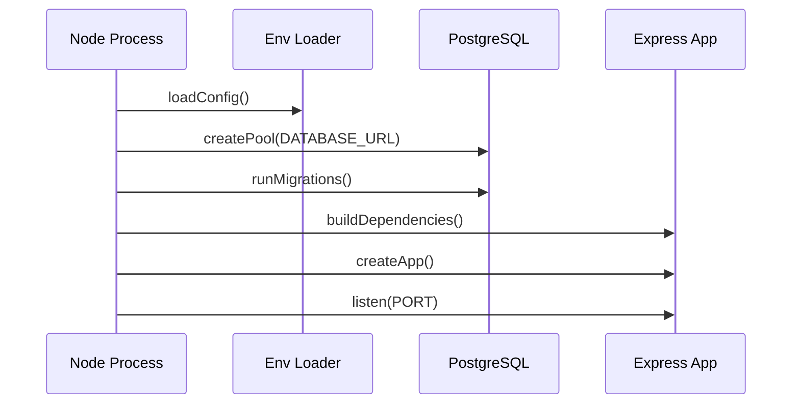
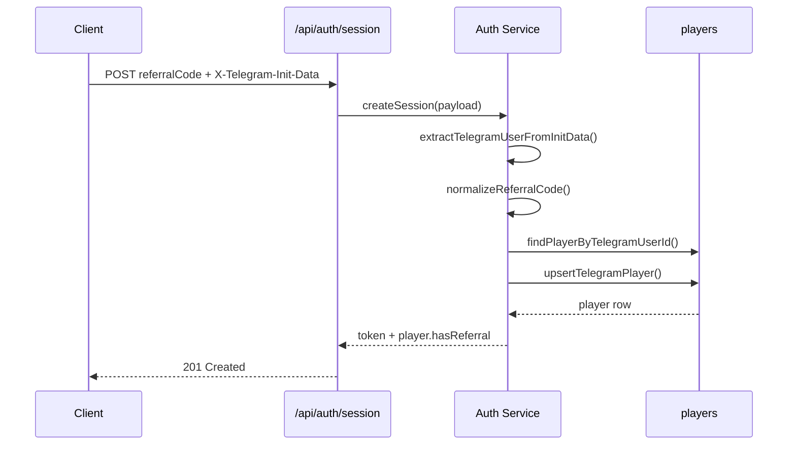
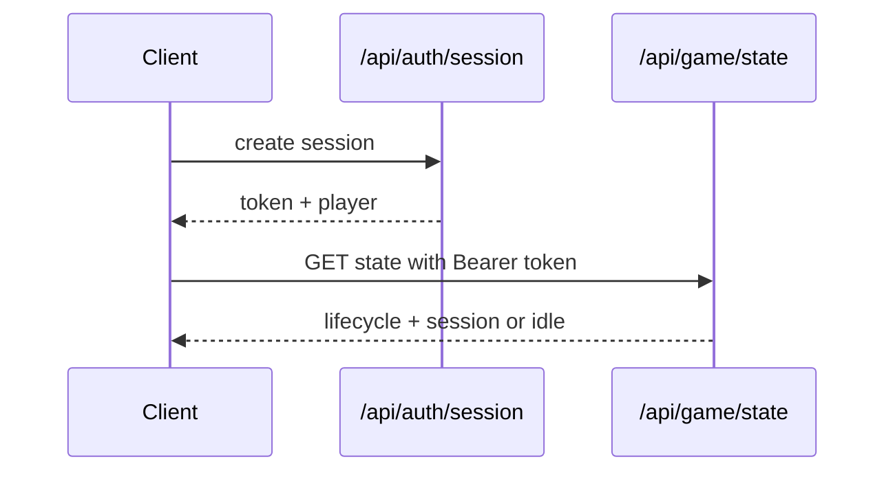
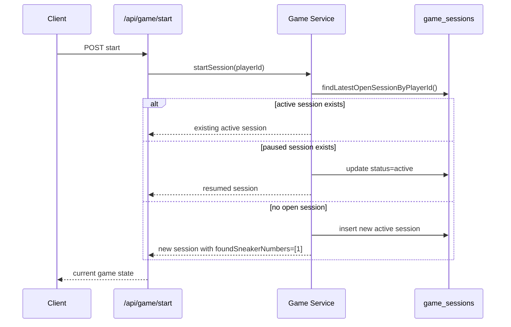
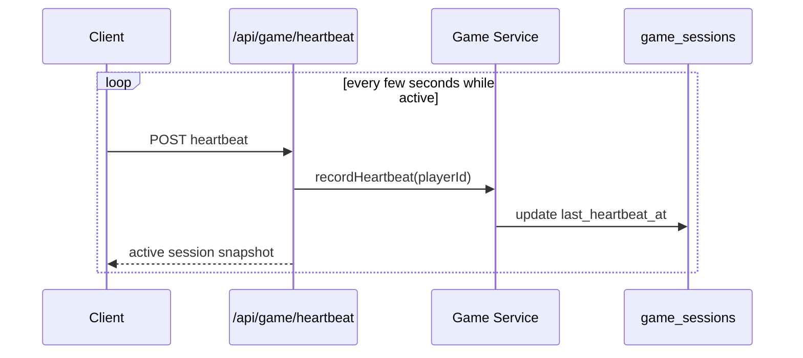
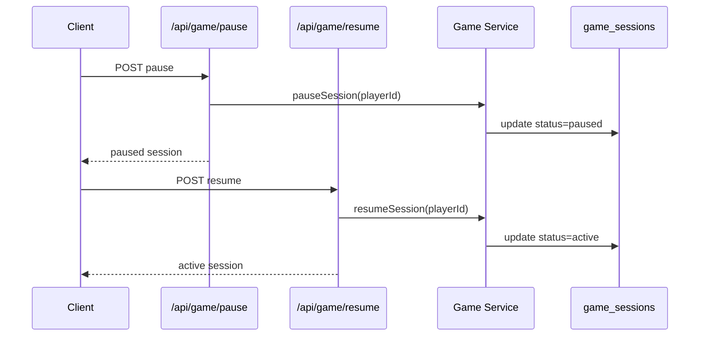
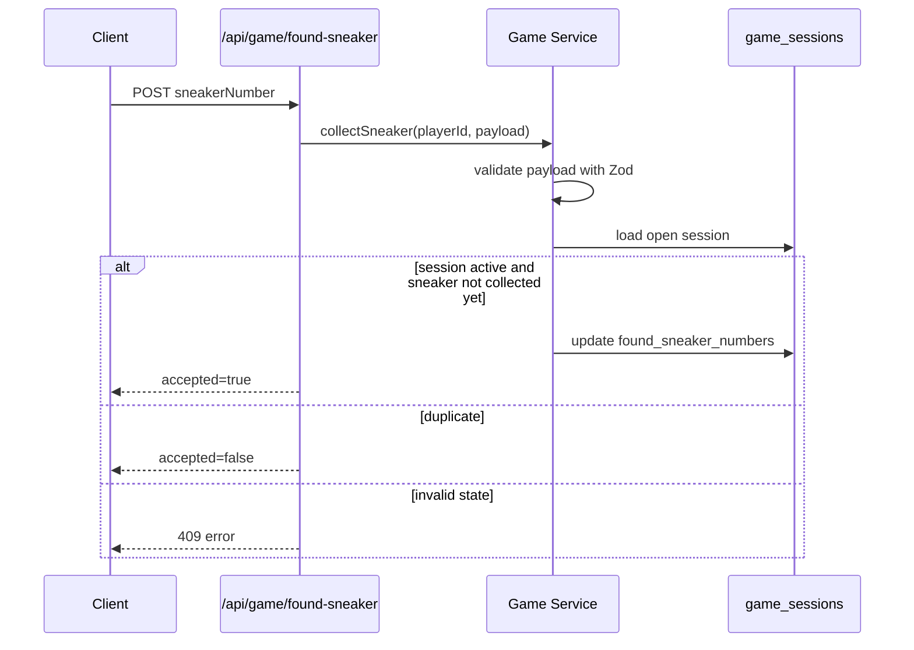
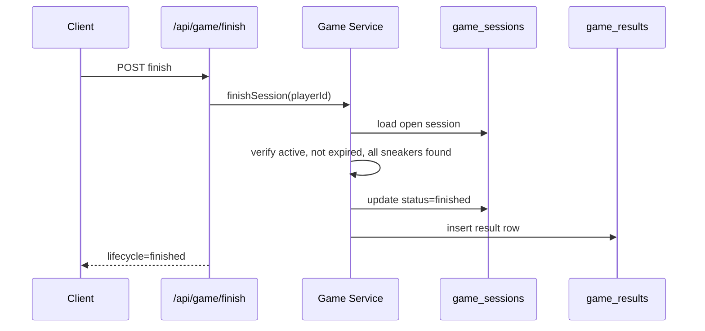
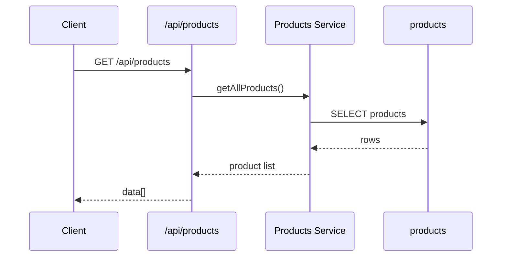
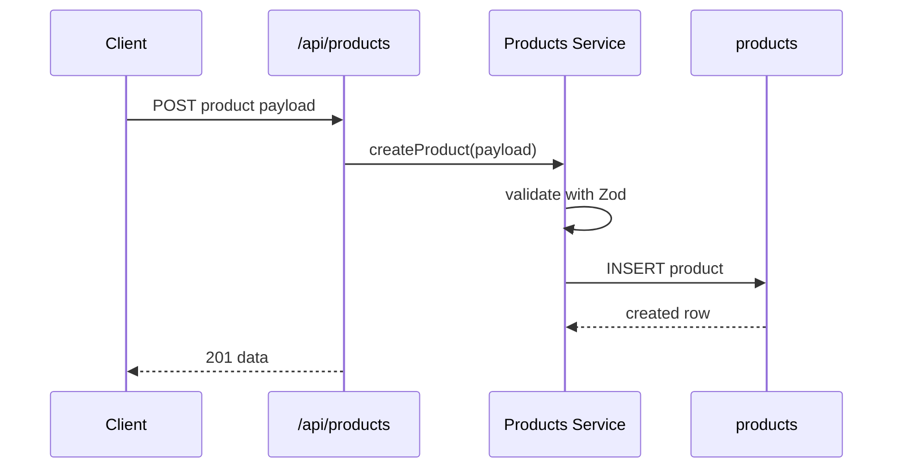

# Sequences

This file shows the main backend flows as step-by-step sequences.

## 1. Server Startup

## 2. Telegram Auth With Referral

## 3. Gameplay Bootstrap

## 4. Start New Game

## 5. Heartbeat Loop

## 6. Pause And Resume

## 7. Collect Sneaker

## 8. Finish Game

## 9. Products Read Flow

## 10. Products Create Flow

